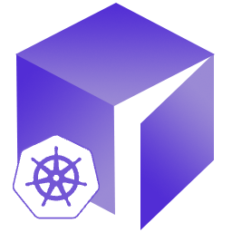

<a id="readme-top"></a>


<!-- PROJECT SHIELDS -->
[![Contributors][contributors-shield]][contributors-url]
[![Forks][forks-shield]][forks-url]
[![Stargazers][stars-shield]][stars-url]
[![Issues][issues-shield]][issues-url]
[![Apache 2.0 License][license-shield]][license-url]
[![Artifact Hub][artifacthub-shield]][artifacthub-url]


<!-- PROJECT LOGO -->
<br />
<div align="center">
  <a href="https://github.com/ptrvsrg/casdoor-operator">
    
  </a>

<h3 align="center">Casdoor Operator</h3>

  <p align="center">
    A tool for automating the resource management of Casdoor instances in Kubernetes environments
    <br />
    <a href="https://github.com/ptrvsrg/casdoor-operator"><strong>Explore the docs »</strong></a>
  </p>
</div>


<!-- TABLE OF CONTENTS -->
<details>
  <summary>Table of Contents</summary>
  <ol>
    <li>
      <a href="#about-the-project">About The Project</a>
      <ul>
        <li><a href="#why-we-built-it">Why We Built It</a></li>
        <li><a href="#how-it-helps">How It Helps</a></li>
      </ul>
    </li>
    <li><a href="#technologies">Technologies</a></li>
    <li>
      <a href="#getting-started">Getting Started</a>
      <ul>
        <li><a href="#minikube">Minikube</a></li>
      </ul>
    </li>
    <li><a href="#contributing">Contributing</a></li>
    <li><a href="#code-of-conduct">Code of Conduct</a></li>
    <li><a href="#license">License</a></li>
    <li><a href="#contact">Contact</a></li>
  </ol>
</details>


<!-- ABOUT THE PROJECT -->

## About The Project <a id='about-the-project'></a>

Simply put, the Casdoor Operator is a tool for automating the resource management of Casdoor instances in Kubernetes
environments.

Casdoor is an open-source identity and access management platform that provides authentication, authorization, and user
management capabilities. Managing Casdoor deployments manually in Kubernetes can be repetitive, error-prone, and
time-consuming. This is where the Casdoor Operator comes in to streamline the process.

### Why We Built It <a id='why-we-built-it'></a>

The Casdoor Operator was created to solve a common problem faced by developers and DevOps teams: deploying and managing
applications in Kubernetes is complex and often tedious. Without automation, you end up writing custom scripts or
performing manual steps to handle tasks like provisioning, configuration, scaling, and health checks.

Typically, these scripts are not reusable, difficult to maintain, and often depend on multiple tools, making it hard to
replicate the process across different environments. The Casdoor Operator eliminates the need for these custom solutions
by providing a robust, reusable, and Kubernetes-native way to manage Casdoor instances.

With the Casdoor Operator, instead of writing complex scripts or manually managing deployments, you define your desired
state in a simple custom resource definition (CRD) file. The operator takes care of the rest, ensuring that your Casdoor
instances are deployed, configured, and maintained according to your specifications.

### How It Helps <a id='how-it-helps'></a>

We have worked hard to make the Casdoor Operator intuitive and powerful, focusing on simplicity, security, and
scalability. Here’s how it benefits users:

* **Automation:** Simplifies the deployment and lifecycle management of Casdoor instances.
* **Consistency:** Ensures consistent configurations across environments using Kubernetes-native tools.
* **Health Monitoring:** Continuously monitors the health of Casdoor instances and updates their status accordingly.
* **Extensibility:** Provides flexibility to customize deployments based on your specific needs.
* **Security:** Supports secure practices such as secret management and signed artifacts.

Our goal is to empower users to focus on building great applications while the Casdoor Operator handles the operational
complexities of managing Casdoor in Kubernetes.

<p align="right">(<a href="#readme-top">back to top</a>)</p>


<!-- TECHNOLOGIES -->

## Technologies <a id='technologies'></a>

* [Golang][golang-url]
* [Operator SDK][operator-sdk-url]
* [Helm][helm-url]
* [Docusaurus][docusaurus-url]

<p align="right">(<a href="#readme-top">back to top</a>)</p>


<!-- GETTING STARTED -->

## Getting Started <a id='getting-started'></a>

<details>
  <summary><b>minikube</b></summary>

### Minikube <a id='minikube'></a>

Minikube provides a local Kubernetes, designed to make it easy to learn and develop for Kubernetes. The Kubernetes
cluster is started either inside a virtual machine, a container or on bare-metal, depending on the minikube driver you
choose.

#### Prerequisites <a id='minikube-prerequisites'></a>

* [minikube][minikube-url]
* [kubectl][kubectl-url]
* [Helm][helm-url]

#### Starting the Kubernetes cluster <a id='minikube-starting-the-kubernetes-cluster'></a>

Run the following command to start a local Kubernetes cluster:

```bash
minikube start --memory=4096 # 2GB default memory isn't always enough
```

#### Install CRDs <a id='minikube-install-crds'></a>

First, download the CRDs from the [releases](https://github.com/ptrvsrg/casdoor-operator/releases) page.

```bash
kubectl apply -f https://github.com/ptrvsrg/casdoor-operator/releases/v0.0.0/download/crds_v0.0.0.yaml
```

#### Install the Casdoor Operator <a id='minikube-install-the-casdoor-operator'></a>

Using Helm, install the Casdoor Operator:

```bash
helm repo add ptrvsrg https://ptrvsrg.github.io/casdoor-operator/charts
helm repo update
helm install casdoor-operator ptrvsrg/casdoor-operator --namespace casdoor-operator
```

Using kubectl to check the status of the deployment of the Casdoor Operator:

```bash
kubectl get deployments -n casdoor-operator
```

</details>

<p align="right">(<a href="#readme-top">back to top</a>)</p>


<!-- CONTRIBUTING -->

## Contributing <a id='contributing'></a>

See [CONTRIBUTING.md](CONTRIBUTING.md) for more information.

<p align="right">(<a href="#readme-top">back to top</a>)</p>


<!-- CODE OF CONDUCT -->

## Code of Conduct <a id='code-of-conduct'></a>

See [CODE_OF_CONDUCT.md](CODE_OF_CONDUCT.md) for more information.


<!-- LICENSE -->

## License <a id='license'></a>

See [LICENSE.md](LICENSE.md) for more information.

<p align="right">(<a href="#readme-top">back to top</a>)</p>


<!-- CONTACT -->

## Contact <a id='contact'></a>

Sergey Petrov - s.petrov1@g.nsu.ru

Project Link: [https://github.com/ptrvsrg/casdoor-operator](https://github.com/ptrvsrg/casdoor-operator)

<p align="right">(<a href="#readme-top">back to top</a>)</p>


<!-- MARKDOWN LINKS & IMAGES -->
<!-- https://www.markdownguide.org/basic-syntax/#reference-style-links -->

[contributors-shield]: https://img.shields.io/github/contributors/ptrvsrg/casdoor-operator.svg?style=for-the-badge

[contributors-url]: https://github.com/ptrvsrg/casdoor-operator/graphs/contributors

[forks-shield]: https://img.shields.io/github/forks/ptrvsrg/casdoor-operator.svg?style=for-the-badge

[forks-url]: https://github.com/ptrvsrg/casdoor-operator/network/members

[stars-shield]: https://img.shields.io/github/stars/ptrvsrg/casdoor-operator.svg?style=for-the-badge

[stars-url]: https://github.com/ptrvsrg/casdoor-operator/stargazers

[issues-shield]: https://img.shields.io/github/issues/ptrvsrg/casdoor-operator.svg?style=for-the-badge

[issues-url]: https://github.com/ptrvsrg/casdoor-operator/issues

[license-shield]: https://img.shields.io/github/license/ptrvsrg/casdoor-operator.svg?style=for-the-badge

[license-url]: https://github.com/ptrvsrg/casdoor-operator/blob/master/LICENSE

[artifacthub-shield]: https://img.shields.io/endpoint?style=for-the-badge&url=https://artifacthub.io/badge/repository/casdoor-operator

[artifacthub-url]: https://artifacthub.io/packages/search?repo=casdoor-operator

[golang-url]: https://go.dev/

[operator-sdk-url]: https://sdk.operatorframework.io/docs/building-operators/golang/

[helm-url]: https://helm.sh/

[docusaurus-url]: https://docusaurus.io/

[minikube-url]: https://minikube.sigs.k8s.io/docs/start/

[kubectl-url]: https://kubernetes.io/docs/reference/kubectl/overview/